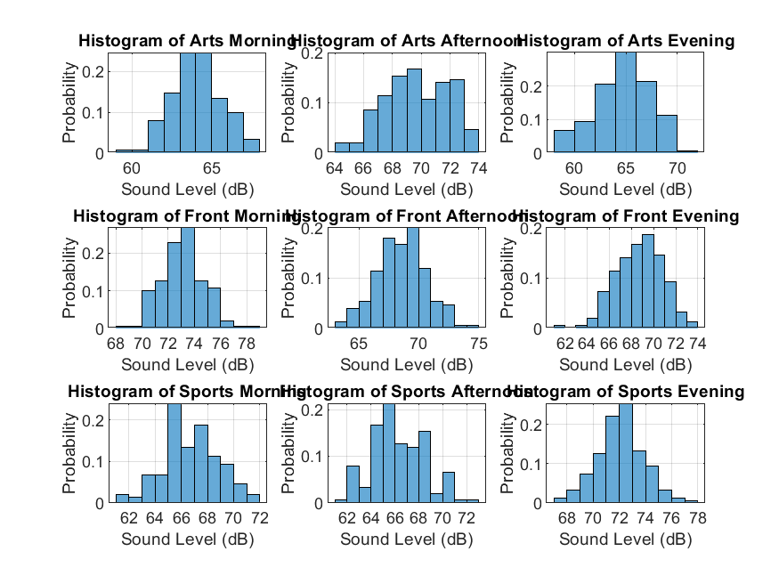
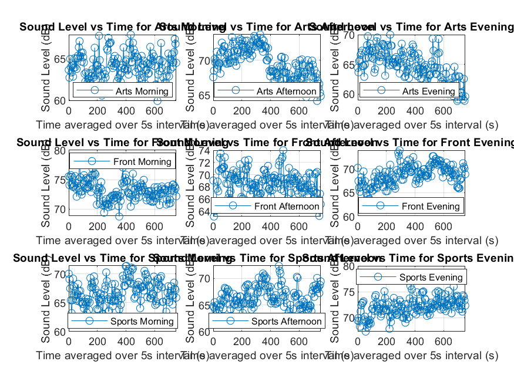
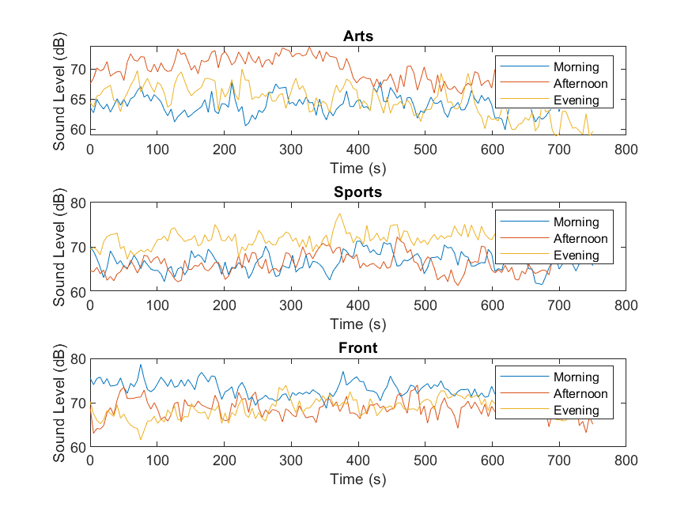
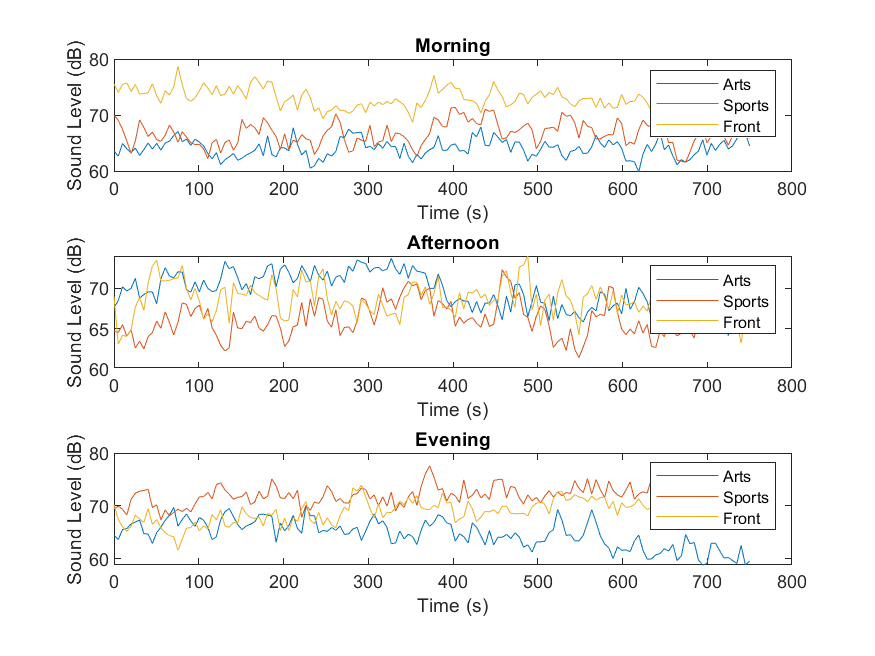
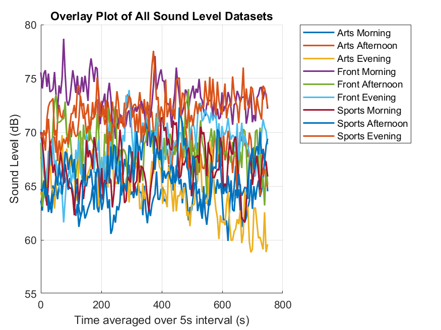

# College-Wide-Sound-Level_Analysis

# Campus Noise Analysis Project

Welcome to the **Campus Noise Analysis** project! THis project involves collecting sound level data from various locations on campus to determine which one is the noisiest. The project is split into two parts: **Data Collection** and **Descriptive Analysis**. Here’s everything you need to know about the project and how we analyzed the noise levels!

## Project Overview

### Part A: Data Collection

Using the **Physics Toolbox Sensor Suite app**, we recorded sound levels at three different times of the day across four days of the week. The collected data was then averaged for every 5-second interval to ensure consistency. We chose the Front gate, Sports Gate and the Arts Gate of Trinity College Dublin to collect data from.

### Part B: Descriptive Analysis
In Part B, we analyzed the collected data using **MATLAB**. This involved:
- Plotting the data to compare noise levels
- Calculating central tendencies (mean, median, standard deviation, etc)
- Generating histograms to visualize the data distribution
- Determining the 5% and 20% trimmed means to account for outliers

---

## Visualizations

Here are the images representing the various analyses and comparisons:

*Histograms representing the noise levels across all datasets.*

*Line plots showing the overall trends for each location and time of day.*

*Detailed line plots focusing on individual campus locations.*

*Detailed line plots focusing on different times of day.*

*Overlay comparison of all datasets.*

---

## Central Tendencies

Below is a table of the central tendency measures (mean, median, standard deviation, etc.) for each dataset:

| Dataset           | Mean (dB) | Median (dB) | Standard Deviation (dB) | Variance (dB) | 1st Quartile (dB) | 3rd Quartile (dB) | Min (dB) | Max (dB) | 5% Trimmed Mean (dB) | 20% Trimmed Mean (dB) |
|-------------------|-----------|-------------|-------------------------|---------------|-------------------|-------------------|----------|----------|----------------------|-----------------------|
| Arts Morning      | 64.13     | 64.07       | 1.57                    | 2.47          | 63.06             | 65.07             | 59.91    | 67.92    | 64.13                | 64.10                 |
| Arts Afternoon    | 69.63     | 69.59       | 2.21                    | 4.91          | 68.09             | 71.46             | 64.12    | 73.73    | 69.66                | 69.68                 |
| Arts Evening      | 64.70     | 64.76       | 2.62                    | 6.86          | 62.97             | 66.80             | 58.86    | 70.02    | 64.72                | 64.80                 |
| Front Morning     | 73.14     | 73.12       | 1.63                    | 2.67          | 72.01             | 74.07             | 68.73    | 78.69    | 73.12                | 73.10                 |
| Front Afternoon   | 68.57     | 68.62       | 2.10                    | 4.41          | 67.21             | 69.98             | 63.09    | 74.02    | 68.58                | 68.58                 |
| Front Evening     | 68.76     | 68.79       | 2.14                    | 4.57          | 67.41             | 70.28             | 61.63    | 73.93    | 68.79                | 68.79                 |
| Sports Morning    | 66.73     | 66.63       | 2.09                    | 4.38          | 65.34             | 68.24             | 61.62    | 71.38    | 66.74                | 66.74                 |
| Sports Afternoon  | 66.30     | 66.07       | 2.21                    | 4.90          | 64.81             | 68.01             | 61.41    | 72.31    | 66.27                | 66.24                 |
| Sports Evening    | 72.09     | 72.13       | 1.77                    | 3.14          | 71.19             | 73.07             | 67.33    | 77.57    | 72.09                | 72.10                 |

---

## License

This project is licensed under the MIT License - see the [LICENSE](LICENSE) file for details.

---

Thank you for exploring the **Campus Noise Analysis** project! If you have any questions or need further details, feel free to reach out!
